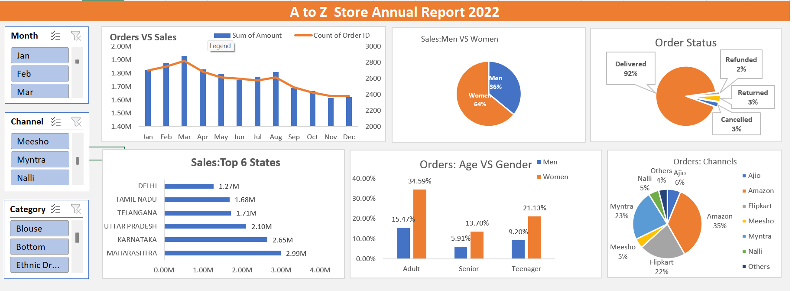

## Excel- A to Z Store Sales Analysis Dashboard

# Objective
Analyze A to Z Store's 2022 sales data to understand customer behavior and improve sales in 2023.

# Tools Used
- Microsoft Excel
- Pivot Tables
- Pivot Charts
- Slicers

# Process

1) Data Cleaning
- Standardized Gender values (M/W to Men/Women)
- Fixed Quantity inconsistencies
- Checked null values and data types

2) Data Processing
- Created Age Group column
- Extracted Month from Order Date

3) Dashboard Analysis
Built an interactive dashboard to analyze:
- Orders vs Sales by Month
- Sales by Gender
- Order Status
- Top 5 States by Sales
- Age vs Gender Analysis
- Sales by Channel

# Key Insights
- Highest sales in March
- Women contributed more sales
- 90% orders delivered
- Maharashtra was the top state
- Adult women contributed most sales
- Amazon was the top sales channel

# Conclusion
A to Z Store should focus on women customers aged 30–49 in top-performing states using targeted ads and offers on Amazon.

# Dashboard Preview

